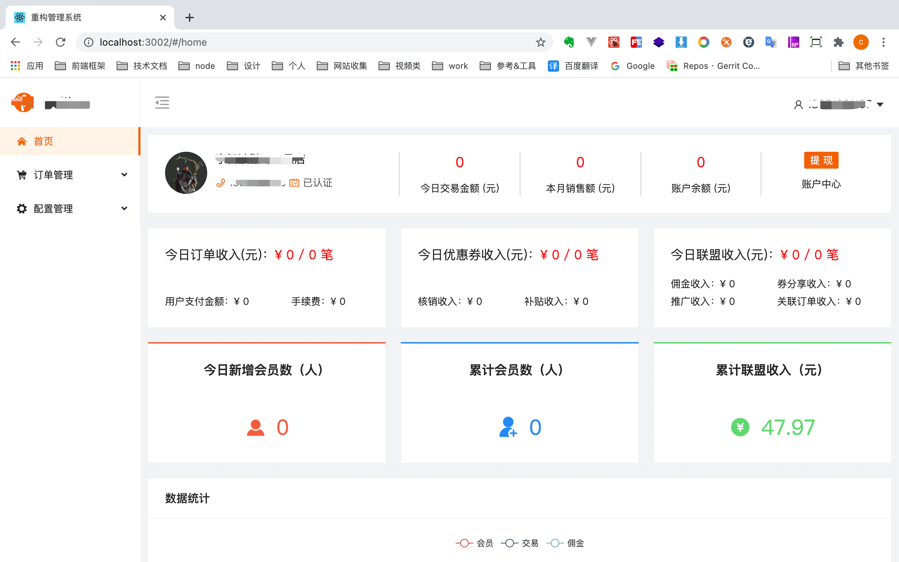
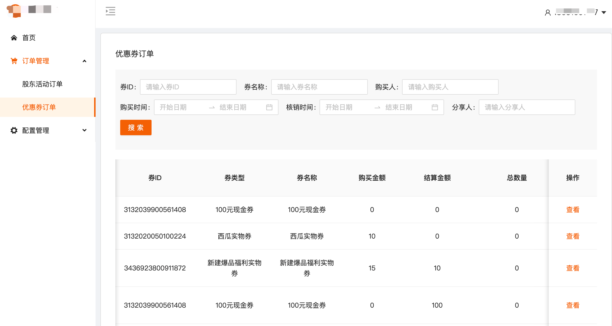

# React 16 + Typescript + Ant Design

<!--  -->

> 一套完美集成 React 3.x + TypeScript + Craco + Scss + Axios + Echarts + React-quill 等健壮的前端快速开发模板

## 相关联系方式

1️⃣&nbsp;[CSDN](https://blog.csdn.net/weixin_43924228)&emsp;2️⃣&nbsp;[Machao's Blog](https://machao07.github.io/)&emsp;3️⃣&nbsp;[ZCOOL站酷](https://machao07.zcool.com.cn/)

## 技术栈

- 编程语言：[TypeScript 4.x](https://www.typescriptlang.org/zh/) + [JavaScript](https://www.javascript.com/)
- 构建工具：[Create-React-App](https://www.html.cn/create-react-app/docs/getting-started/)
- 前端框架：[React 16.x](https://react.docschina.org/docs/getting-started.html)
- 路由工具：[React-Router-Dom 5.x](https://next.router.vuejs.org/zh/index.html)
- 状态管理：[Redux 4.x](https://www.redux.org.cn/)
- UI 框架：[Ant Design](https://ant.design/components/overview-cn/)
- CSS 预编译：[Stylus](https://stylus-lang.com/) / [Sass](https://sass.bootcss.com/documentation) / [Less](http://lesscss.cn/)
- HTTP 工具：[Axios](https://axios-http.com/)
- Git Hook 工具：[husky](https://typicode.github.io/husky/#/) + [lint-staged](https://github.com/okonet/lint-staged)
- 代码规范：[Prettier](https://prettier.io/) + [ESLint](https://eslint.org/)

## 快速开始
### `yarn start`

## 效果图

> 首页

<!--   -->
 

> 优惠券订单

<!--  -->

